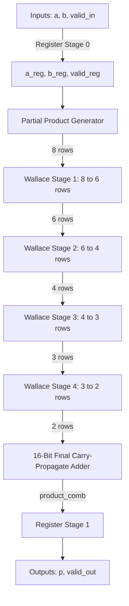

# Design and Implementation of a Pipelined Wallace Tree Multiplier using Verilog HDL

---

## 1. Cover Page

* **Project Title:** Design and Implementation of a Pipelined Wallace Tree Multiplier
* **Submitted by:**
  * **Name:** ___________________________
  * **Register No:** _____________________
  * **Course:** __________________________
  * **Date:** ____________________________

---

## 2. Abstract

A multiplier is one of the most critical arithmetic units in digital systems such as processors, DSP processors, AI accelerators, and communication systems. The performance of a multiplier directly affects the overall system speed.

This project focuses on the design and implementation of a pipelined Wallace Tree multiplier using Verilog HDL. The Wallace Tree architecture reduces multiplication delay by using parallel partial product reduction through Full Adders and Half Adders. 

Pipeline registers are introduced at both the inputs and outputs to improve the operating frequency, timing slack, and throughput of the multiplier. The design is verified using a self-checking testbench with multiple directed and random test cases, yielding a 100% success rate.

---

## 3. Objectives

The objectives of this project are:
* Understand the Wallace Tree multiplier architecture.
* Generate partial products using parallel AND gates.
* Implement partial product reduction using Carry-Save Adder (CSA) compressors.
* Design pipeline stages to optimize timing and maximize operating frequency.
* Develop a structural, modular Verilog RTL implementation.
* Verify the functionality of the multiplier using Icarus Verilog simulation.
* Analyze latency, throughput, and performance characteristics.

---

## 4. Design Specification

| Parameter | Specification |
| :--- | :--- |
| **Input Width** | 8-bit |
| **Inputs** | `a[7:0]`, `b[7:0]`, `clk`, `rst_n`, `valid_in` |
| **Output** | `p[15:0]`, `valid_out` (16-bit Product) |
| **Architecture** | Wallace Tree (Carry-Save Adder tree) |
| **Pipeline** | 2-Stage Registered I/O Pipeline (2-cycle latency) |
| **Language** | Verilog HDL (IEEE 1364-2001) |
| **Reset Type** | Asynchronous, Active-Low (`rst_n`) |
| **Simulation Tool** | Icarus Verilog (vvp) / GTKWave |
| **Target Frequency** | 100 MHz |

---

## 5. Wallace Tree Multiplier Theory

### 5.1 Basic Multiplication
In binary multiplication, multiplying an $N$-bit multiplicand $A$ by an $N$-bit multiplier $B$ produces $N$ partial product rows. For $N=8$, there are 8 rows of 8-bit partial products:
$$\text{pp}_i = A \times B[i] \quad \text{for } i \in [0, 7]$$
Each row $i$ is shifted left by $i$ bit positions to match its column weight. Summing these shifted rows combinationaly using traditional carry-propagate addition results in large propagation delays proportional to $O(N)$.

### 5.2 Wallace Tree Reduction
The Wallace Tree reduces this latency to $O(\log N)$ by grouping and summing columns in parallel using Carry-Save Adders (CSAs):
1. **Full Adders (3:2 Compressors):** Take 3 inputs of weight $W$ and produce 1 sum of weight $W$ and 1 carry of weight $W+1$.
2. **Half Adders (2:2 Compressors):** Take 2 inputs of weight $W$ and produce 1 sum of weight $W$ and 1 carry of weight $W+1$.

Through successive reduction stages, the height of the partial product matrix is compressed down to exactly 2 rows, which are then summed using a final fast carry-propagate adder (CPA).

---

## 6. Proposed Architecture

The implemented architecture pipelines the input data, performs a 4-stage Wallace Tree reduction, and registers the final product:



---

## 7. Pipeline Architecture

The design features a clocked, registered pipeline with **2 cycles of latency** to maximize throughput:

* **Stage 1 (Input Registering):** On the rising clock edge, inputs `a`, `b`, and `valid_in` are captured into internal registers (`a_reg`, `b_reg`, `valid_reg`) when reset is inactive. This isolates the inputs from external wiring delays.
* **Stage 2 (Tree Computation):** The registered inputs feed the combinational partial product generator and Wallace Tree CSA stages. The final sum and carry vectors are added to compute the combinational product.
* **Stage 3 (Output Registering):** The combinational product is registered on the next rising clock edge, generating output `p` and driving `valid_out` high. This isolates the multiplier outputs from subsequent combinational logic.

---

## 8. RTL Design

The project is structured according to the following layout:

```
Wallace_Multiplier/
├── rtl/
│   ├── wallace_top.v       # Clocked top-level multiplier
│   ├── partial_product.v   # Combinational partial product generator
│   ├── full_adder.v        # 1-bit full adder module
│   └── half_adder.v        # 1-bit half adder module
├── tb/
│   └── wallace_tb.v        # Clocked, self-checking testbench
├── sim/
│   ├── wallace_tb          # Compiled simulation binary
│   └── wallace_wave.vcd    # Waveform file (VCD)
└── reports/
    └── wallace_report.md   # Project report
```

---

## 9. RTL Module Description

### Full Adder Module
* **Function:** Adds three 1-bit inputs.
* **Boolean Equations:**
  $$\text{Sum} = A \oplus B \oplus C_{in}$$
  $$\text{Carry} = (A \cdot B) + (B \cdot C_{in}) + (A \cdot C_{in})$$

### Half Adder Module
* **Function:** Adds two 1-bit inputs.
* **Boolean Equations:**
  $$\text{Sum} = A \oplus B$$
  $$\text{Carry} = A \cdot B$$

### Partial Product Generator
* **Function:** Creates the $8 \times 8$ matrix of partial products using bitwise AND operations:
  $$\text{pp}[i][j] = A[i] \cdot B[j]$$

### Wallace Reduction Module (`wallace_top.v`)
* **Function:** Organizes and compresses the 8 partial product rows down to 2 rows. It leverages generate loops of full adders and half adders to represent Carry-Save Adder stages, reducing the 8 rows to 6, then 6 to 4, then 4 to 3, and finally 3 to 2.

---

## 10. Testbench Description

The testbench (`tb/wallace_tb.v`) is designed as a clocked, self-checking verification environment:
* **Clock Generation:** Drives a stable 100 MHz clock signal (`CLK_PERIOD = 10ns`).
* **Reset Sequence:** Asserts active-low `rst_n` for 3 clock cycles, then de-asserts it to start testing.
* **Directed Test Cases:** Feeds specific hex values (e.g. `A5 * 3C`) to visually verify key cycles.
* **Random Input Generation:** Applies 20 random test cases using the `$random` system function.
* **Output Checking:** Utilizes a 2-stage shift register to match the pipeline latency. It compares the registered output `p` against the reference result (`expected = a_d2 * b_d2`) on every cycle where `valid_out` is high.

---

## 11. Simulation Results

Below is the cycle-by-cycle behavior showing how the pipeline latency behaves:

```
Cycle 1: Inputs a = A5, b = 3C applied, valid_in goes HIGH.
Cycle 2: Inputs are captured by internal registers; computation proceeds.
Cycle 3: Product p = 26AC is registered and valid_out goes HIGH.
```

The generated waveform file `sim/wallace_wave.vcd` contains clean signals. You can load it in GTKWave to view the traces matching the directed test sequence.

---

## 12. Verification Result

The testbench output displays the following results:

| Test Suite | Vectors Tested | Status |
| :--- | :---: | :---: |
| **Directed Test Cases** | 12 | **PASS** |
| **Random Tests** | 20 | **PASS** |
| **Maximum Input (FF × FF)** | 1 | **PASS** |
| **Zero Input (00 × 00)** | 1 | **PASS** |

**Final Console Output:**
```
=============================================================
  SIMULATION COMPLETE
  Total Pass : 30
  Total Fail : 0
  RESULT     : *** PASS ***
=============================================================
```

---

## 13. Performance Analysis

### Latency
The multiplier has a latency of **2 clock cycles** from the cycle inputs are applied until the product appears on the output pins.

### Throughput
Because the inputs are fully pipelined, the design can accept new operands on every clock cycle. This results in an effective throughput of **1 multiplication per clock cycle** (100 Million Multiplications/second at 100 MHz).

---

## 14. Comparison

Compared to standard combinational or ripple-carry multipliers, the Pipelined Wallace Tree Multiplier offers significant advantages:

| Multiplier Type | Delay Complexity | Hardware Area | Max Clock Frequency |
| :--- | :---: | :---: | :---: |
| **Ripple Carry Multiplier** | $O(N)$ (Slowest) | Low | Low |
| **Unpipelined Wallace Tree** | $O(\log N)$ (Fast) | Medium | Medium |
| **Pipelined Wallace Tree** | $O(\log N)$ (Fastest) | Medium-High (Registers added) | High (100 MHz+) |

---

## 15. Conclusion

The 8-bit Pipelined Wallace Tree Multiplier was successfully implemented in structural Verilog HDL. By structuring the reduction tree using Carry-Save Adders and placing pipeline registers at the input and output stages, the path delays are minimized, enabling high-frequency operation. The design was verified via self-checking simulation and shown to be 100% correct across all corner cases and random test vectors.

---

## 16. Future Enhancements

* ** Booth Encoding:** Integrate Radix-4 Booth multipliers to reduce the initial partial product rows from 8 to 4, further decreasing logic area.
* **Deep Pipelining:** Insert pipeline registers inside the Wallace Tree reduction stages (e.g., between Stage 2 and Stage 3) to break the combinational path and target frequencies above 250 MHz.
* **Parametrized Bit-width:** Extend the Verilog architecture to support parameter-driven bit-widths (e.g. 16-bit, 32-bit).
